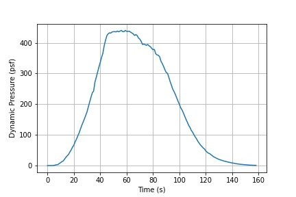

# Illustration of "MAX Q"

## Overview

Watch any coverage of a rocket launch and almost always
there is a special call out for when the rocket reaches
something called "max q". The announcer, or someone
in the launch audio, will call this out. What is Max Q
and why does it matter?

## What is Max Q?

A complete answer for this would require a fair amount
of background information in aerodynamics. Briefly, `Q`
is the symbol commonly used in aerodynamics for `dynamic
pressure`. This is like using `M` for Mach or `a` for angle
of attack. So "Max Q" is simply the maximum dynamic pressure.

## Why is Max Q important?

Aerodynamic forces, `F`, on an object increase directly with
dynamic pressure:

> `F = S * Q * C`

where `S` is surface area, `Q` is dynamic pressure, and `C`
is the aerodynamic coefficient for the object. The values
for `S` and `C` are essentially invariant for a given rocket.
So it's only `Q` that determines the magnitude of the
aerodynamic forces. Further,`Q` is defined as:

> `Q = 1/2 * rho * v^2`

where `rho` is air density and `v` is speed.
**Note that speed is squared.** This means if the speed
increases by 2, the aerodynamic forces increase by 4.

## OK, but why is that important?

TBH - don't know. Best guess is it's a critical design
point. Weight is a premium for rocket launches. Any
reduction in rocket weight can directly be used to increase
payload weight - which is the whole point of the rocket.
So, in order to optimize rocket weight, they are probably
designed with a low factor of safety around a specified
dynamic pressure. Then at launch time, fingers are
crossed when the rocket actually flies through this
design point.

## Speed vs. Density

Intuitively we know a rocket's speed during launch is
increasing as it makes its way into orbit. However, it is
also going higher and higher in the atmosphere and is thus
seeing decreasing density. As shown above, these are the
two values used to compute dynamic pressure. During a rocket
launch, speed is going up while density is going down.

## Telemetry Data

To obtain some real rocket telemtry data, the
[launch video](https://www.youtube.com/watch?v=3pv01sSq44w)
for the [SpaceX Inspiration 4](https://en.wikipedia.org/wiki/Inspiration4)
was paused frame-by-frame to obtain the base data of `time`,
`speed`, and `velocity`.

This was done by hand, entering the
values into a CSV text file.

## Analysis

The telemetry data was then analyzed in a Jupyter Notebook.
The [ambiance](https://pypi.org/project/ambiance/) standard
atmosphere was used to provide atmospheric properties for
a given altitude. The rest is just math.

## Results

Here is a plot of Q vs. altitude:

Here is a plot of Q vs. time:

In both plots it can be seen that Max Q is a somewhat broad
point. This is why the rocket needs to "throttle down"
when going through Max Q. This slows acceleration and takes
advantage of the decreasing density to keep the resulting Q
at a constant value - the Max Q limit.